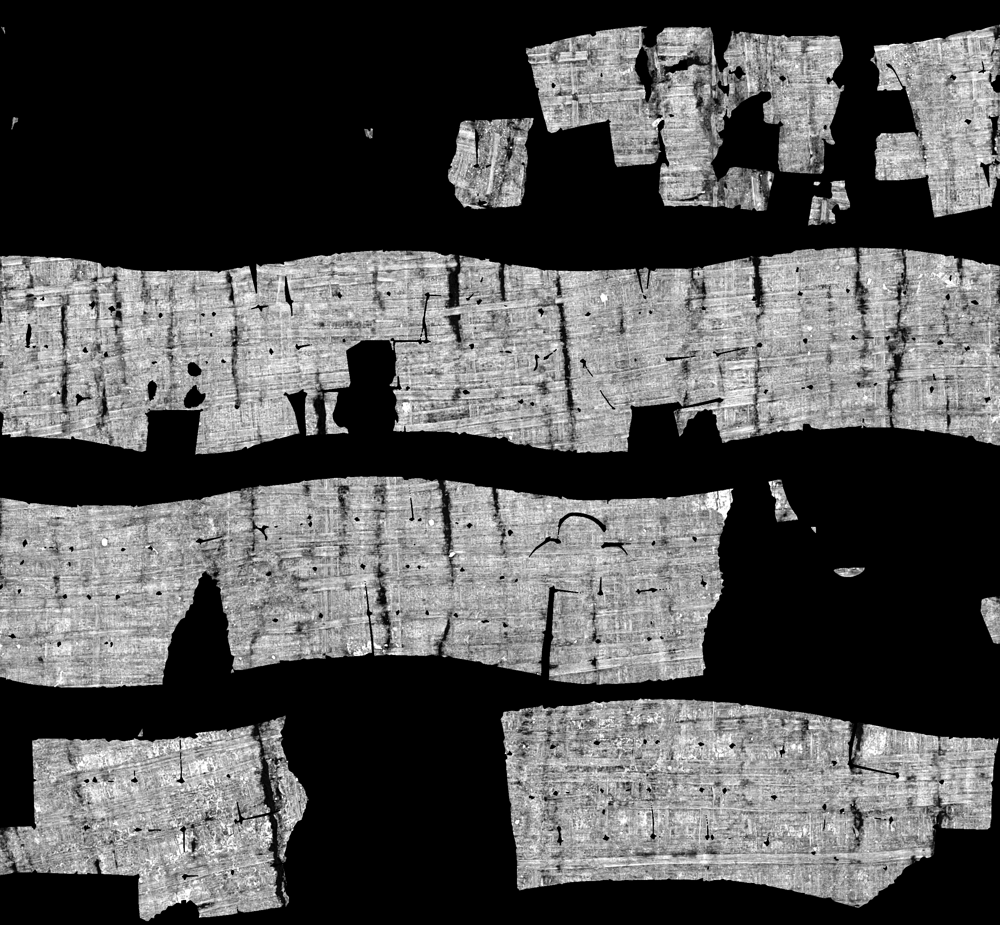

# Native sheet assembly

`sheet_assemble` (September 2026) turns a pile of per-cube meshes into
flattened, CT-textured sheets. It is an alternative to the registration-first
route (`scroll_whole` → `scroll_unroll`), which is still built and documented
in [PIPELINE.md](PIPELINE.md).

```text
grid_pipeline ──> sheet_assemble ──> obj_bake_raw ──> sheet_strip / sheet_reading
   (dump/)        (sheets, audit,      (CT texture)     sheet_layers / vmesh_tifxyz
                   verdict)
```

The assembler treats the meshes as the unit of work. It flattens every chart,
relates charts across cube seams and places them in one winding-aware parameter
domain. It then repairs overlap, seam and metric defects and audits every source
face before it exports anything. Source triangles keep their 3-D geometry, and
the audit checks that they do.

## Inputs

- **A mesh pile.** This is the `dump/` directory that `grid_pipeline` writes.
  Keep its default zero trim inset, so charts reach the cube faces where the
  seams are measured. When the scroll geometry is known, also pass
  `--umb-y/--umb-x/--wrap-pitch` and, if you have one, `--axis-table`.
- **RAW CT** for baking. This can be `cubes_RAW/` TIFFs or an uncompressed
  `uint8` Zarr v2 array with 128³ chunks.
- **The public configuration**, [`configs/default.json`](../configs/default.json),
  with schema `scrollfiesta-config-v1`. It is loaded when the configuration
  argument is omitted. Paths (`raw_source.path`, `bake.exe`, `verdict.exe`,
  `geometry.axis_table`) are relative to the working directory. Set the CT
  and executable paths before running. `compute.threads` sets the OpenMP team.
- **An axis table** (optional): `z,y,x` rows along the umbilicus.
  `scroll_axis_track` derives one from a mesh pile. The supplied
  [`configs/axis.csv`](../configs/axis.csv) contains the PHerc0139 reference.

## Reference configuration

The settings come from the existing PHerc0139 4×5×5 assembly and flattening
profiles. The reference crop contains 100 cubes with origins in the half-open
voxel ranges `z=[4352,4864)`, `y=[3072,3712)`, `x=[2560,3200)`, at stride 128.
The config processes the entire supplied pile; it does not silently crop it.

The common `geometry` section supplies the axis `(y,x)=(3405,2878)`, wrap
spacing `9.5`, and reference axis table. Assembly uses these for placement and
the verdict; the optional `quadribbon` tool reads the same file. `core`,
`registration`, and the bake window/darkness fields are used by quadribbon.
Assembly keeps its native texture window. The repair budget is 900 seconds
with eight threads; chart admission and clearance/closure passes use the native
defaults. The budget is a work limit, not a quality guarantee.

The release check on the saved `head_39e72d0_20260826` 100-cube mesh pile
completed through audit with all source geometry preserved and no invalid or
out-of-band faces, but only 47.4% area coverage and 171 overlapping triangle
pairs. `geometry_qualified` is therefore `false`. This is a starting
configuration; reproducing the curated checkpoint-58 atlas is a separate
registration/atlas workflow described in [PIPELINE.md](PIPELINE.md).

For another dataset, change the geometry and axis table as well as the input
paths. To derive an axis from the new pile, remove `geometry.axis_table` and
set `axis.derive` to `true`. For a Linux CMake build, set `bake.exe` to
`build/obj_bake_raw` and `verdict.exe` to `build/ribbon_verdict`. For Windows
the supplied paths target `build/Release/`. Use absolute paths for an
installation in another directory. CMake installs the configuration and axis
under `share/scrollfiesta/configs/`; copy them to your working directory's
`configs/` directory and update the executable and CT paths there.

```powershell
build\Release\grid_pipeline.exe PHerc0139-4x5x5 output\mesh `
  --halo 13 --trim-inset 0 --skip-weld --max-concurrent 8 --threads-per-cube 1
build\Release\sheet_assemble.exe output\mesh\dump output\sheet configs\default.json
```

## One staged run

```text
sheet_assemble <pile_dir> <out_dir> [config.json] [--stop-after <stage>]
               [--resume-placement stage5_state.asr]
```

| Stage | Work | Main artifacts |
|---|---|---|
| `clean` | Flatten every chart; classify blobs and set aside unusable charts. | `stage1_clean.json`, `stage1_charts.png` |
| `axis` | Fix the measurement frame from the axis table or the umbilicus. | `stage1_axis.{csv,json,png}` |
| `relate` | Find the seam relations between charts across cube faces. | `stage2_relate.json`, `stage2_pairs.csv` |
| `pose` | Cut stacked layers apart and pose the related charts. | `stage3_pose.json`, `stage3_layout.png` |
| `clean2` | Resolve contradictory relations. | `stage4_clean2.json` |
| `place` | Place the related components in one winding-aware domain, under continuity and metric guards. | `stage5_placed.png`, `stage5_place.json`, `stage5_state.asr` |
| `discover` | Run a second admission pass for material that was left out. | `stage5_discovery.csv`, `stage5_discovered.png` |
| `repair` | Repair seam residuals, overlap and metric distortion on the original faces. | `stage6_repair.json`, `stage6_repaired.vmesh` (+ sidecars), `stage6_repaired.png` |
| `audit` | Account for every source face, contact and seam obligation. | `stage7_audit.json`, `stage7_{charts,contacts,metric_faces,seams}.csv` |
| `sheet` | Export, bake and score the sheet. | `sheet.vmesh`/`.obj`, `sheet_extras.vmesh`, `bake/`, `verdict.json`, `scores.json` |

With `resume` on (the default), `clean` reuses each cube's cleaned charts from
an earlier run into the same output directory. `--resume-placement` restarts
at `discover` from a saved placement. `--stop-after` accepts the stage names in
the table above. `stage6_progress.asr` retains the repaired chart state for
review and finishing.

An exit status of zero means the requested processing completed. It does not
mean the sheet is good. Read `geometry_qualified` in `stage7_audit.json`.
Source mismatches and invalid embeddings stop the export. Overlap or distortion
can still be exported, but only as sheets that are explicitly unqualified.

## Reference preview

The [September release evidence](../submission_update/release/README.md)
contains the reviewed PHerc0139 4×5×5 CT sheet and its full audit. It uses the
saved repaired layout directly, with no reading-order repacking. The native
11,170 × 642 raster is wrapped into four rows for display:



This preview uses an explicit contrast window of [47,193]. It preserves the
partial sheet's 47.4% source-area coverage and leaves boundary faces unpainted
when their normal samples reach beyond the available RAW cubes. The evidence
index records the exact bake command and distinguishes raster crack fill from
directly sampled coverage.

## Review and strip pages

`--review` writes chart bounds and source-boundary indices from a checkpoint.
`--winding-order` arranges intact pieces for reading and audits the result;
it requires a qualified layout. After a successful staged run and audit:

```powershell
sheet_assemble --review output\sheet\stage6_progress.asr output\review configs\axis.csv
sheet_assemble --winding-order output\sheet\stage6_progress.asr configs\axis.csv output\reading
obj_bake_raw output\reading\stage6_repaired.vmesh <raw> output\reading\bake `
  --id sheet --normal-range 4 --normal-samples 9 --raster-du 1 --raster-dv 1 `
  --window 0 255 --raster-auto --skip-faces-reaching-missing-raw
sheet_strip output\reading output\pages
```

Use the full executable paths if the tools are not on `PATH`. The winding
layout writes its own `stage7_audit.json`. Run `sheet_assemble --help` to list
the supported commands.

## Finishing tools

| Tool | Use |
|---|---|
| `obj_bake_raw` | Bakes RAW CT per pixel through a flattened VMESH. It also writes textured OBJs and PNG tile pyramids (`--tile-tiff`). |
| `ribbon_verdict` | Scores a sheet against the acceptance gates. `sheet_assemble` runs it during the `sheet` stage. |
| `sheet_strip` | Turns a review layout (`ribbon_layout.json` plus `bake/`) into strip pages: the ribbon flows into lines in spiral order, with small pieces in a tray at the end. `--texture` lays any raster on the same grid, such as an ink map, out identically. |
| `sheet_reading` | Flips mirror-imaged pieces of a sheet image or strip page into reading handedness. It uses the handedness file from `sheet_layers`. |
| `sheet_layers` | Writes the surface volume on the sheet's pixel grid for ink detection: layers along the inward normal, a support mask and per-piece handedness. |
| `vmesh_tifxyz` | Exports the largest pieces as VC3D tifxyz segments. |
| `scroll_axis_track` | Derives the umbilicus curve from a mesh pile or a world-frame VMESH. |
| `swirl_slim` | Cuts radius-gated inter-wrap bridges in a marbled region, then SLIM-refines each freed piece. |
| `grid_carve` | Carves 128³ TIFF cubes from a local Zarr v2 array. MSBuild only; see below. |

## Building and running

- `sheet_assemble` needs a BLAS/LAPACK for TAUCS, like `scroll_whole`. It also
  compiles the vendored OSQP 1.0 in `deps/osqp/`. The CMake build skips it when
  no LAPACK is found.
- With MSVC it links `deps/clapack/TS/`, a copy of the twelve BLAS/LAPACK
  routines TAUCS reaches with their f2c locals made automatic. This lets it
  factor many systems at once without a lock. Other toolchains keep TAUCS
  serialized. The MSVC builds reserve a 512 MB stack, because TAUCS recursion
  overflows the default on large sheets. On Linux, raise `ulimit -s` and
  `OMP_STACKSIZE` for large runs.
- The tools were developed and validated on Windows with MSVC. The CMake build
  also targets Linux, but large runs there have not been validated.
- Every tool has a `--selftest`, and `ctest` runs them for the CMake-built
  tools. The `sheet_assemble` suite builds miniature assemblies and takes about
  100 s on 8 threads.
- `grid_carve` reads Blosc-compressed chunks through c-blosc2, which is not
  vendored. Build it with `msbuild grid_carve.vcxproj /p:BloscRoot=<dir>`,
  where `<dir>` holds `include/blosc2.h`, `lib/blosc2.lib` and
  `lib/libblosc2.dll`. The `blosc2` Python wheel ships that layout under
  `site-packages/blosc2`.
